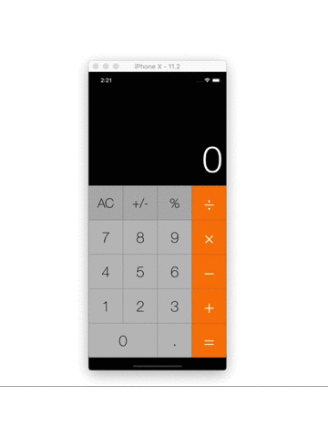
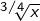
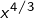

# Overview
-----------------------------------------------------------------------------

`NIBCalculator` (__No Interface Builder Calculator__) is an iOS calculator application written in Objective-C. As the name implies, the user interface was coded programatically.

The calculator employs the [Reverse Polish Notation(RPN)](https://en.wikipedia.org/wiki/Reverse_Polish_notation) algorithm to calculate operations.

# Hightlighted Features
-----------------------------------------------------------------------------

There are some notable features, in the author's opinion, as follows:

* Autolayout
* Being light-weight, only takes about 600KB.
* Do not memorize the Error when press button `m+`.
* Can handle larger exponentation computation upto 170! while the built-in iOS calculator only can handle upto 103!
* Can handle fractional root of negative number such as  or fractional exponentation of negative number such as  where `x < 0`
* Hyperbolic function `sinh(x)` or `cosh(x)` report `Error` when `x -> ∞`

# Documentation
-----------------------------------------------------------------------------

The documentation of the application was generated using [AppleDoc](https://github.com/tomaz/appledoc) and locates at directory Help/html/index.html.

# Credits
-----------------------------------------------------------------------------

Lieu Vu.